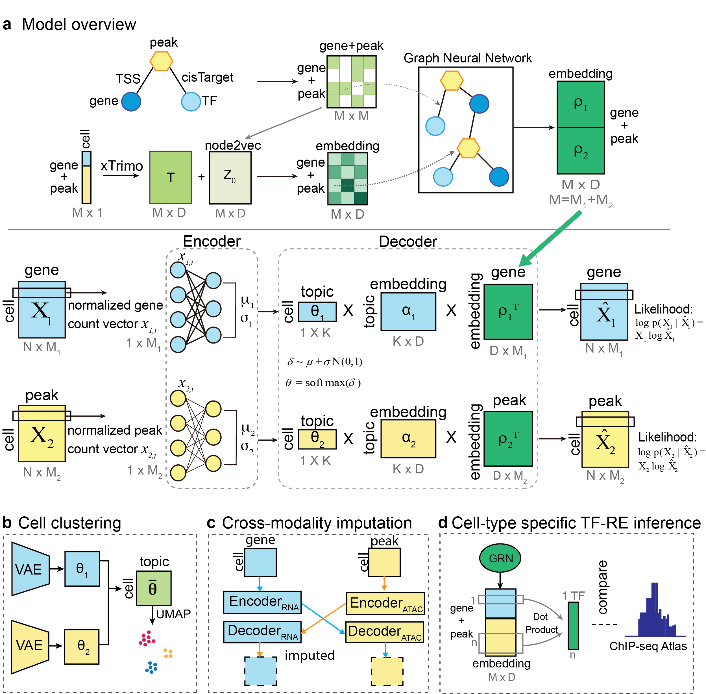

# scGraphETM: : Graph-Based Deep Learning Approach for Unraveling Cell Type-Specific Gene Regulatory Networks from Single-Cell Multi-Omics Data


## Model Overview

scGraphETM is a novel deep learning framework designed to uncover cell type-specific gene regulatory networks (GRNs) from single-cell multi-omics data. The model integrates scRNA-seq and scATAC-seq data through a hybrid architecture that combines three key components: (1) a Variational Autoencoder (VAE) with self-attention for dimensionality reduction and feature learning, (2) a Graph Neural Network (GNN) that leverages prior knowledge from gene regulatory networks, and (3) a linear decoder design that enhances interpretability. 
The model uniquely incorporates the xTrimoGene approach for generating cell-specific embeddings and employs GraphSAGE for efficient neighborhood aggregation in large-scale networks. Using an embedded topic model as the encoder, scGraphETM can simultaneously perform multiple tasks including cell type clustering, cross-modality imputation, and cell type-specific TF-RE relationship inference.



## Installation

### Environment Setup
```bash
# Create conda environment
conda create -n scgraph python=3.10
conda activate scgraph

# Install PyTorch and PyTorch Geometric
conda install pytorch pytorch-cuda=11.8 -c pytorch -c nvidia
conda install pyg -c pyg

# Install other dependencies
pip install -r requirements.txt
```

### Requirements
- Python >= 3.10
- PyTorch >= 1.12.0
- PyTorch Geometric
- scanpy
- anndata
- pybedtools

### Project Structure
```
project/
├── components/        # Model components
├── data/             # Data directory
├── model.py          # Main model implementation
├── train.py          # Training script
├── impute_main.py    # Imputation script
└── eval_grn.py       # GRN evaluation script
```

## Tutorial

### 1. Model Training
```bash
python train.py \
    --date 2025-02-05 \
    --use_gnn \
    --model_name base_model
```

### 2. Run Imputation
```bash
python impute_main.py \
    --date 2025-02-05 \
    --model_name base_model \
    --plot_path ./result/imputation \
    --use_gnn \
```

### 3. Evaluate GRN
```bash
python eval_grn.py \
    --date 2025-02-05 \
    --model_name base_model \
    --chipseq_file path/to/chipseq_data.bed \
    --cell_type CD4 \
    --use_gnn \
```

### Output Structure
```
result/
├── PBMC/
│   └── 2025-02-05/
│       ├── figure/            # Training visualizations
│       ├── imputation/        # Imputation results
│       └── grn_eval/          # GRN evaluation results
└── weights/
    └── PBMC/
        └── best_model_2025-02-05_base_model.pth
```

## Dataset

### Required Data Format
1. **RNA-seq Data**
   - Format: h5ad (AnnData)
   - Required columns:
     - obs: 'cell_type', 'batch'
     - var: 'highly_variable'

2. **ATAC-seq Data**
   - Format: h5ad (AnnData)
   - Required columns:
     - obs: 'cell_type', 'batch'
     - var: 'chrom', 'chromStart', 'chromEnd'

3. **ChIP-seq Data** (for GRN evaluation)
   - Format: BED
   - Required columns: chrom, start, end, name

### Data Organization
```
data/
├── PBMC/
│   ├── RNA_count.h5ad           # Raw RNA count matrix
│   ├── ATAC_count.h5ad          # Raw ATAC count matrix
│   ├── hvg_only_rna_count.h5ad  # Filtered RNA data
│   └── hvg_tg_re_nearby_dist_1000000_ATAC.h5ad  # Processed ATAC data
└── node2vec/
    └── PBMC_model_512_400.pt    # Pre-trained embeddings
```

### Available Datasets
- PBMC (Peripheral Blood Mononuclear Cells) [10X Genomics](https://support.10xgenomics.com/single-cell-multiome-atac-gex/datasets/1.0.0/pbmc\_granulocyte\_sorted\_10k?)
- BMMC (Bone Marrow Mononuclear Cells) [GSE194122](https://www.ncbi.nlm.nih.gov/geo/query/acc.cgi?acc=GSE194122) [GSE204684](https://www.ncbi.nlm.nih.gov/geo/query/acc.cgi?acc=GSE204684)
- Cerebral Cortex [GSE204684](https://www.ncbi.nlm.nih.gov/geo/query/acc.cgi?acc=GSE204684)
- [CisTarget](https://resources.aertslab.org/cistarget/)
- [Chip-Seq Atlas](https://chip-atlas.org/)

Each dataset should have matching cells between RNA-seq and ATAC-seq modalities.